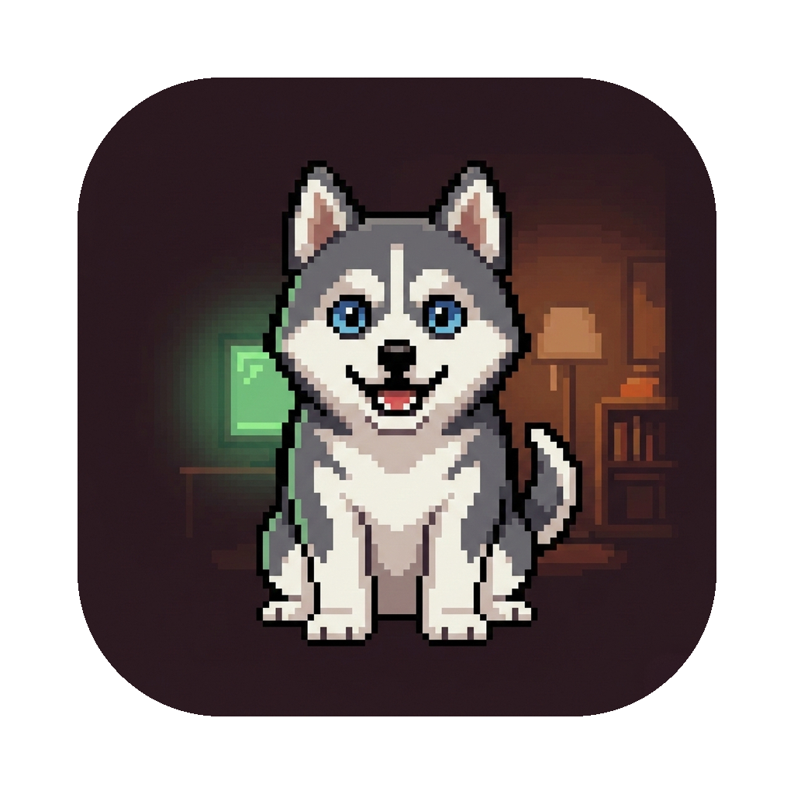
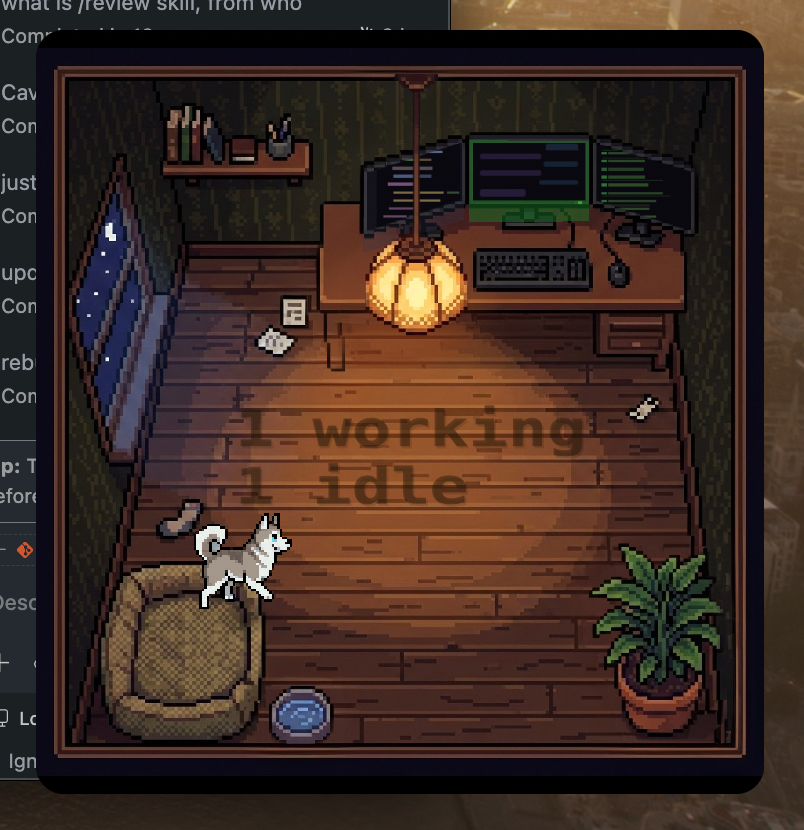

<p align="center">
  
</p>

# AgentPong

A cozy pixel art desktop pet for Claude Code. A husky lives in a tiny office on your screen, watching your coding sessions through miniature monitors that light up in real time. It barks at errors, tilts its head when you need to approve something, and naps when everything is quiet.



## Features

- **Reactive monitors** -- 3 screens glow green/yellow/red based on Claude Code session status
- **Click to jump** -- click a monitor to switch to that terminal session
- **Permission approval** -- approve/deny Claude Code tool use directly from the widget
- **Husky pet** -- 12+ behaviors: wander, sit, sleep, play, drink, zoomies, watch your cursor
- **Pet reactions** -- barks at errors, tilts head at warnings, naps when all quiet
- **Real-time** -- local HTTP server receives Claude Code hook events instantly
- **Always-on-top** -- borderless floating window, draggable, two sizes (170x170 / 364x382)

## Quick Start

### Homebrew (recommended)

```bash
brew tap ericermerimen/tap
brew install agentpong
brew services start agentpong   # Launch now + auto-start on login
agentpong setup                 # Configure Claude Code hooks
```

Restart any running Claude Code sessions for hooks to take effect.

**Or paste this into any Claude Code session:**

> Run `agentpong setup` to install AgentPong hooks for real-time session tracking.

This writes a hook script to `~/.agentpong/hooks/hook-sender.sh` and registers it in `~/.claude/settings.json` for these events:

```json
{
  "hooks": {
    "SessionStart": [{ "hooks": [{ "type": "command", "command": "/Users/you/.agentpong/hooks/hook-sender.sh" }] }],
    "SessionEnd":   [{ "hooks": [{ "type": "command", "command": "/Users/you/.agentpong/hooks/hook-sender.sh" }] }],
    "Stop":         [{ "hooks": [{ "type": "command", "command": "/Users/you/.agentpong/hooks/hook-sender.sh" }] }],
    "PreToolUse":   [{ "hooks": [{ "type": "command", "command": "/Users/you/.agentpong/hooks/hook-sender.sh" }] }],
    "PostToolUse":  [{ "hooks": [{ "type": "command", "command": "/Users/you/.agentpong/hooks/hook-sender.sh" }] }],
    "Notification": [{ "hooks": [{ "type": "command", "command": "/Users/you/.agentpong/hooks/hook-sender.sh" }] }]
  }
}
```

The hook script reads JSON from stdin (Claude Code's hook API) and POSTs it to AgentPong's local HTTP server. For permission events (`PreToolUse` with `ask` mode), it holds the connection open until you Allow/Deny from the widget.

### From source

```bash
git clone https://github.com/ericermerimen/agentpong.git
cd agentpong
make install   # Builds .app, links to /Applications, runs setup
```

To auto-start on login, add AgentPong in System Settings > General > Login Items.

### Requirements

- macOS 14 (Sonoma) or later
- Claude Code CLI installed
- Optional: `jq` (improves click-to-jump accuracy)

## Usage

AgentPong runs as a menu bar app -- no dock icon, just a cube in your menu bar.

**Window controls:**
- **Drag** anywhere to move
- **Right-click** for context menu (size, sessions, quit)
- **Hover** top edge for close button
- **Click a monitor** to see sessions, click a row to jump to it
- **Click the husky** 3 times to scare it

**CLI:**
```bash
agentpong             # Launch the app
agentpong setup       # Install hooks + configure Claude Code
agentpong status      # List active sessions
agentpong report      # Report a session event (used by hooks)
agentpong --version   # Print version
```

## Monitors

3 monitors, each mapped to one session (highest priority in center):

| Position | Priority | Glow |
|----------|----------|------|
| Center | Highest | Green = running, Yellow = waiting, Red = error |
| Left | Second | Same |
| Right | Third | Same |

Priority: needsInput > error > running > idle. Sessions beyond the top 3 are accessible via the click overlay. Monitors also show decorative pixel art (code editor, chat, social feeds) that changes with status.

## Husky

Always in the room. Picks behaviors by weighted random, interrupted by screen events:

- **Idle** -- wander, sit, lie down, look around, play, drink water, watch your cursor
- **Zoomies** -- rare sprint zigzag across the room
- **Sleep** -- curls up on dog bed when all screens are off for 30+ seconds
- **Bark** -- runs to monitor and barks when a red screen appears
- **Head tilt** -- walks to monitor when yellow screen appears
- **Scare** -- sprints to far corner if you click it 3 times

## Updating

```bash
# Homebrew
brew upgrade agentpong   # auto-restarts if using brew services

# From source
git pull && make install
pkill -x AgentPong && open /Applications/AgentPong.app
```

## Uninstalling

```bash
# Homebrew
brew services stop agentpong
brew uninstall agentpong
rm -rf ~/.agentpong

# From source
make uninstall
```

Then remove AgentPong hooks from `~/.claude/settings.json` (search for "agentpong").

## Building

```bash
swift build              # Debug build
swift build -c release   # Release build
swift test               # Run tests
make app                 # Build .app bundle
make archive             # Build + create .tar.gz for Homebrew
```

## Data

All state lives in `~/.agentpong/`:

| Path | Contents |
|------|----------|
| `sessions/*.json` | Active session data |
| `hooks/hook-sender.sh` | Hook bridge script (installed by setup) |
| `server-port` | HTTP server port (written on startup) |
| `themes/background.png` | Room background |
| `themes/foreground.png` | Room foreground layer |
| `sprites/` | Sprite assets |

## Tech Stack

Swift 5.9+ / SpriteKit / NSPanel / NWListener HTTP server / Swift Package Manager / macOS 14+. Zero dependencies. Sprites by PixelLab MCP, backgrounds by Gemini.

## License

[PolyForm Noncommercial 1.0.0](LICENSE)
